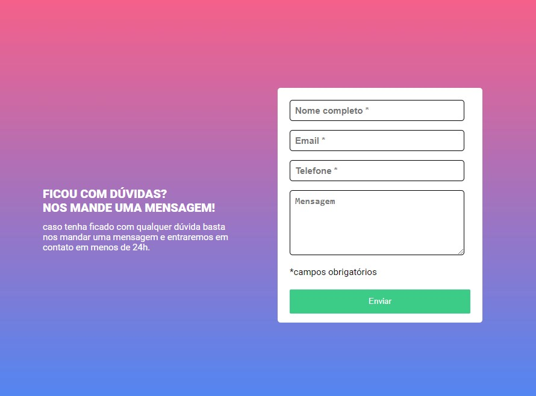

<h1 align="center">Quest JS Intermediário ⚔</h1>

  

Desafio de construção de um formulário com validações de campo. Atividade proposta pelo DevQuest.

 
 <h2>🕹️ Tecnologias Utilizadas</h2>
    <ul align="center">
        
        
        
    </ul>

 

<h2 align="center">🤔 Como Utilizar</h2>
 
Preenchimento dos campos de nome, email, telefone e mensagem. Ao clicar em enviar será analisado se os campos foram carregados corretamente:
 

<h2 align="center">📐 Página Responsiva ✂️</h2>

O projeto apresenta responsividade na navegação dos principais dispositivos: 

<ul>
    <li>Desktop 🖥️</li>
    <li>Tablet 💻</li>
    <li>Smartphone 📱</li>
</ul>

<h2 align="center">🔗 Link da página</h2>

Logo abaixo temos o link da página para visualização e testes:

👉 <a href="https://oseiasweb.github.io/Quest-Validacao-Cadastro-JS/" target="_blank">Quest JS Intermediário ⚔</a>  